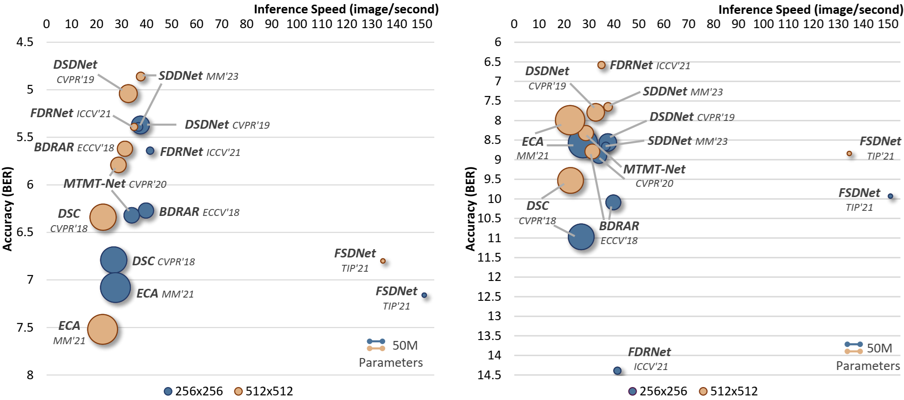
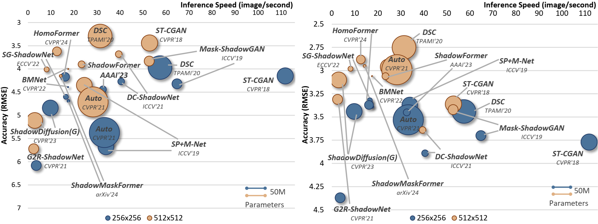

# Unveiling Deep Shadows: A Survey on Image and Video Shadow Detection, Removal, and Generation in the Era of Deep Learning

by [Xiaowei Hu*](https://xw-hu.github.io/), [Zhenghao Xing*](https://harryhsing.github.io/), [Tianyu Wang](https://stevewongv.github.io/), [Chi-Wing Fu](https://www.cse.cuhk.edu.hk/~cwfu/), and [Pheng-Ann Heng](http://www.cse.cuhk.edu.hk/~pheng)             

https://arxiv.org/abs/2409.02108

***

This repository contains the results and trained models for deep-learning methods used in shadow detection, removal, and generation, as presented in our paper "Unveiling Deep Shadows: A Survey on Image and Video Shadow Detection, Removal, and Generation in the Era of Deep Learning." This paper presents a comprehensive survey of shadow detection, removal, and generation in images and videos within the deep learning landscape over the past decade, covering tasks, deep models, datasets, and evaluation metrics. Key contributions include a comprehensive survey of shadow analysis, standardization of experimental comparisons, exploration of the relationships among model size, speed, and performance, a cross-dataset generalization study, identification of open issues and future directions, and provision of publicly available resources to support further research.

## Table of Contents

## Table of Contents

1. [Highlights](#highlights)
2. [Image Shadow Detection](#image-shadow-detection)
   - [Comparing Image Shadow Detection Methods](#comparing-image-shadow-detection-methods)
   - [Cross-Dataset Generalization Evaluation](#cross-dataset-generalization-evaluation)
   - [Qualitative Results](#qualitative-results-1)
   - [Weights and Code](#trained-models-and-code)
   - [Datasets](#datasets)
   - [Metrics](#metrics)
   - [Papers](#papers)
3. [Video Shadow Detection](#video-shadow-detection)
   - [Comparison of Video Shadow Detection Methods](#comparison-of-video-shadow-detection-methods)
   - [Qualitative Results](#qualitative-results-2)
   - [Weights and Code](#trained-models-and-code-1)
   - [Dataset](#dataset)
   - [Metrics](#metrics-1)
   - [Papers](#papers-1)
4. [Instance Shadow Detection](#instance-shadow-detection)
   - [Comparing Image Instance Shadow Detection Methods](#comparing-image-instance-shadow-detection-methods)
   - [Cross-Dataset Generalization Evaluation](#cross-dataset-generalization-evaluation-1)
   - [Qualitative Results](#qualitative-results-3)
   - [Weights and Code](#trained-models-and-code-2)
   - [Datasets](#datasets-1)
   - [Metrics](#metrics-2)
   - [Papers](#papers-2)
5. [Image Shadow Removal](#image-shadow-removal)
   - [Comparing Image Shadow Removal Methods](#comparing-image-shadow-removal-methods)
   - [Cross-Dataset Generalization Evaluation](#cross-dataset-generalization-evaluation-2)
   - [Qualitative Results](#qualitative-results-4)
   - [Weights and Code](#trained-models-and-code-3)
   - [Datasets](#datasets-2)
   - [Metrics](#metrics-3)
   - [Papers](#papers-3)
6. [Document Shadow Removal](#document-shadow-removal)
   - [Comparing Document Shadow Removal Methods](#comparing-document-shadow-removal-methods)
   - [Qualitative Results](#qualitative-results-5)
   - [Weights and Code](#trained-models-and-code-4)
   - [Dataset](#dataset)
   - [Papers](#papers-4)
7. [Facial Shadow Removal](#facial-shadow-removal)
   - [Papers](#papers-5)
8. [Image Shadow Generation](#image-shadow-generation)
   - [Papers](#papers-6)
9. [Bibtex](#bibtex)


## Highlights
+ A Comprehensive Survey of Shadow Analysis in the Deep Learning Era.
+ Fair Comparisons of the Existing Methods. Unified platform + newly refined datasets with corrected noisy labels and ground-truth images.
+ Exploration of Model Size, Speed, and Performance Relationships. A more comprehensive comparison of different evaluation aspects.
+ Cross-Dataset Generalization Study. Assess the generalization capability of deep models across diverse datasets.
+ Overview of Open Issues and Future Directions with AIGC and Large Models.
+ Publicly Available Results, Trained Models, and Evaluation Metrics.


## Image Shadow Detection

### Comparing image shadow detection methods on SBU-Refine and CUHK-Shadow

|  |
|:--------------------------------------:|
|Shadow detection methods on the SBU-Refine (left) and CUHK-Shadow (right) datasets: accuracy, parameters (indicated by the area of the bubbles), and speed.|


| Input Size | Methods                                   | BER (SBU-Refine) (↓) | BER (CUHK-Shadow) (↓) | Params (M) | Infer. (images/s) |
|:----------:|:-----------------------------------------:|:----------------:|:-----------------:|:----------:|:-----------------:|
| 256x256    | DSC (CVPR 2018, TPAMI 2020)               | 6.79             | 10.97             | 122.49     | 26.86             |
|            | BDRAR (ECCV 2018)                         | 6.27             | 10.09             | 42.46      | 39.76             |
|            | DSDNet# (CVPR 2019)                       | 5.37             | 8.56              | 58.16      | 37.53             |
|            | MTMT-Net$ (CVPR 2020)                     | 6.32             | 8.90              | 44.13      | 34.04             |
|            | FDRNet (ICCV 2021)                        | 5.64             | 14.39             | 10.77      | 41.39             |
|            | FSDNet* (TIP 2021)                        | 7.16             | 9.93              | 4.39       | 150.99            |
|            | ECA (MM 2021)                             | 7.08             | 8.58              | 157.76     | 27.55             |
|            | SDDNet (MM 2023)                          | 5.39             | 8.66              | 15.02      | 36.73             |
| 512x512    | DSC (CVPR 2018, TPAMI 2020)               | 6.34             | 9.53              | 122.49     | 22.59             |
|            | BDRAR (ECCV 2018)                         | 5.62             | 8.79              | 42.46      | 31.34             |
|            | DSDNet# (CVPR 2019)                       | 5.04             | 7.79              | 58.16      | 32.69             |
|            | MTMT-Net$ (CVPR 2020)                     | 5.79             | 8.32              | 44.13      | 28.75             |
|            | FDRNet (ICCV 2021)                        | 5.39             | 6.58              | 10.77      | 35.00             |
|            | FSDNet* (TIP 2021)                        | 6.80             | 8.84              | 4.39       | 134.47            |
|            | ECA (MM 2021)                             | 7.52             | 7.99              | 157.76     | 22.41             |
|            | SDDNet (MM 2023)                          | 4.86             | 7.65              | 15.02      | 37.65             |

**Notes**:
- Evaluation on an NVIDIA GeForce RTX 4090 GPU
- $: additional training data
- *: real-time shadow detector
- #: extra supervision from other methods

### Cross-dataset generalization evaluation. Trained on SBU-Refine and tested on SRD

| Input Size | Metric | DSC (CVPR 2018, TPAMI 2020) | BDRAR (ECCV 2018) | DSDNet# (CVPR 2019) | MTMT-Net$ (CVPR 2020) | FDRNet (ICCV 2021) | FSDNet* (TIP 2021) | ECA (MM 2021) | SDDNet (MM 2023) |
|:----------:|:-------:|:------------------------:|:---------------:|:-----------------:|:-------------------:|:----------------:|:----------------:|:-----------:|:--------------:|
| 256x256    | BER (↓)   | 11.10                    | 9.13            | 10.29             | 9.97                | 11.82            | 12.13            | 11.97        | 8.64          |
| 512x512    | BER (↓)   | 11.62                    | 8.53            | 8.92              | 9.19                | 8.81             | 11.94            | 12.71        | 7.65          |

### Qualitative Results

- #### Results for SBU-Refine and CUHK-Shadow Datasets:

   - [Results-Part1](https://github.com/xw-hu/Unveiling-Deep-Shadows/releases/download/Results/ShadowDetection-1.zip)
   - [Results-Part2](https://github.com/xw-hu/Unveiling-Deep-Shadows/releases/download/Results/ShadowDetection-2.zip)

- #### Cross-Dataset Generalization Evaluation:

   Trained on SBU-Refine and tested on SRD dataset:
   
   - [Cross-Dataset Results](https://github.com/xw-hu/Unveiling-Deep-Shadows/releases/download/Results/ShadowDetection_CrossVal.zip)

### Weights and Code
You can download the weights and find the code repositories for these models below:
| Methods                                  | Weights (256x256)  | Weights (512x512)  | Code  |
|:----------------------------------------:|:------------------:|:------------------:|:------------------:|
| DSC (CVPR 2018, TPAMI 2020)              | [link](https://github.com/xw-hu/Unveiling-Deep-Shadows/releases/download/Weights_SD/DSC_256.zip)          | [link](https://github.com/xw-hu/Unveiling-Deep-Shadows/releases/download/Weights_SD/DSC_512.zip)          | [link](https://github.com/stevewongv/DSC-PyTorch)          |
| BDRAR (ECCV 2018)                        | [link](https://github.com/xw-hu/Unveiling-Deep-Shadows/releases/download/Weights_SD/BDRAR_256.zip)          | [link](https://github.com/xw-hu/Unveiling-Deep-Shadows/releases/download/Weights_SD/BDRAR_512.zip)          | [link](https://github.com/zijundeng/BDRAR)          |
| DSDNet# (CVPR 2019)                      | [link](https://github.com/xw-hu/Unveiling-Deep-Shadows/releases/download/Weights_SD/DSDNet_256.zip)          | [link](https://github.com/xw-hu/Unveiling-Deep-Shadows/releases/download/Weights_SD/DSDNet_512.zip)          | [link](https://quanlzheng.github.io/projects/Distraction-aware-Shadow-Detection.html)          |
| MTMT-Net$ (CVPR 2020)                    | [link](https://github.com/xw-hu/Unveiling-Deep-Shadows/releases/download/Weights_SD/MTMT-Net_256.zip)          | [link](https://github.com/xw-hu/Unveiling-Deep-Shadows/releases/download/Weights_SD/MTMT-Net_512.zip)          | [link](https://github.com/eraserNut/MTMT)          |
| FDRNet (ICCV 2021)                       | [link](https://github.com/xw-hu/Unveiling-Deep-Shadows/releases/download/Weights_SD/FDRNet_256.zip)          | [link](https://github.com/xw-hu/Unveiling-Deep-Shadows/releases/download/Weights_SD/FDRNet_512.zip)          | [link](https://github.com/rayleizhu/FDRNet)          |
| FSDNet* (TIP 2021)                       | [link](https://github.com/xw-hu/Unveiling-Deep-Shadows/releases/download/Weights_SD/FSDNet_256.zip)          | [link](https://github.com/xw-hu/Unveiling-Deep-Shadows/releases/download/Weights_SD/FSDNet_512.zip)          | [link](https://github.com/xw-hu/FSDNet)          |
| ECA (MM 2021)                            | [link](https://github.com/xw-hu/Unveiling-Deep-Shadows/releases/download/Weights_SD/ECA_256.zip)          | [link](https://github.com/xw-hu/Unveiling-Deep-Shadows/releases/download/Weights_SD/ECA_512.zip)          | [link](https://github.com/AHU-VRV/ECA-ShadowDetection)          |
| SDDNet (MM 2023)                         | [link](https://github.com/xw-hu/Unveiling-Deep-Shadows/releases/download/Weights_SD/SDDNet_256.zip)          | [link](https://github.com/xw-hu/Unveiling-Deep-Shadows/releases/download/Weights_SD/SDDNet_512.zip)          | [link](https://github.com/rmcong/SDDNet_ACMMM23)          |

### Datasets
- [SBU-Refine](https://github.com/hanyangclarence/SILT/releases/tag/refined_sbu)
- [CUHK-Shadow](https://github.com/xw-hu/CUHK-Shadow#cuhk-shadow-dateset)
- SRD [Training](https://drive.google.com/file/d/1W8vBRJYDG9imMgr9I2XaA13tlFIEHOjS/view?pli=1), [Test](https://drive.google.com/file/d/1GTi4BmQ0SJ7diDMmf-b7x2VismmXtfTo/view), and [Masks](https://yuhaoliu7456.github.io/projects/RRL-Net/index.html)

### Metric
- BER: see this GitHub repository.

### Papers
1. **CNN-CRF**: 
   - Khan et al., "Automatic feature learning for robust shadow detection", CVPR, 2014. [[paper]](https://openaccess.thecvf.com/content_cvpr_2014/html/Khan_Automatic_Feature_Learning_2014_CVPR_paper.html)
   - Khan et al., "Automatic shadow detection and removal from a single image", TPAMI, 2016. [[paper]](https://ieeexplore.ieee.org/abstract/document/7172555)  
2. **SCNN-LinearOpt**: Shen et al., "Shadow optimization from structured deep edge detection", CVPR, 2015. [[paper]](https://openaccess.thecvf.com/content_cvpr_2015/html/Shen_Shadow_Optimization_From_2015_CVPR_paper.html)  
3. **Stacked-CNN**: 
   - Vicente et al., "Large-scale training of shadow detectors with noisily-annotated shadow examples", ECCV, 2016. [[paper]](https://link.springer.com/chapter/10.1007/978-3-319-46466-4_49)
   - Hou et al., "Large scale shadow annotation and detection using lazy annotation and stacked CNNs", TPAMI, 2021. [[paper]](https://ieeexplore.ieee.org/abstract/document/8873648)  
4. **scGAN**: Nguyen et al., "Shadow detection with conditional generative adversarial networks", ICCV, 2017. [[paper]](https://openaccess.thecvf.com/content_iccv_2017/html/Nguyen_Shadow_Detection_With_ICCV_2017_paper.html)  
5. **Patched-CNN**: Hosseinzadeh et al., "Fast shadow detection from a single image using a patched convolutional neural network", IROS, 2018. [[paper]](https://ieeexplore.ieee.org/abstract/document/8594050)  
6. **ST-CGAN**: Wang et al., "Stacked conditional generative adversarial networks for jointly learning shadow detection and shadow removal", CVPR, 2018. [[paper]](https://openaccess.thecvf.com/content_cvpr_2018/html/Wang_Stacked_Conditional_Generative_CVPR_2018_paper.html)  
7. **DSC**: 
   - Hu et al., "Direction-aware spatial context features for shadow detection", CVPR, 2018. [[paper]](https://openaccess.thecvf.com/content_cvpr_2018/html/Hu_Direction-Aware_Spatial_Context_CVPR_2018_paper.html)
   - Hu et al., "Direction-aware spatial context features for shadow detection and removal", TPAMI, 2020. [[paper]](https://ieeexplore.ieee.org/abstract/document/8723605)  
8. **DC-DSPF**: Wang et al., "Densely cascaded shadow detection network via deeply supervised parallel fusion", IJCAI, 2018. [[paper]](https://www.ijcai.org/proceedings/2018/0140.pdf)  
9. **CPNet**: Mohajerani et al., "CPNet: A context preserver convolutional neural network for detecting shadows in single RGB images", MMSP, 2018. [[paper]](https://ieeexplore.ieee.org/abstract/document/8547080)  
10. **A+D Net**: Le et al., "A+D Net: Training a shadow detector with adversarial shadow attenuation", ECCV, 2018. [[paper]](https://openaccess.thecvf.com/content_ECCV_2018/html/Hieu_Le_AD_Net_Training_ECCV_2018_paper.html)
11. **BDRAR**: Zhu et al., "Bidirectional feature pyramid network with recurrent attention residual modules for shadow detection", ECCV, 2018. [[paper]](https://openaccess.thecvf.com/content_ECCV_2018/html/Lei_Zhu_Bi-directional_Feature_Pyramid_ECCV_2018_paper.html)  
12. **DSDNet**: Zheng et al., "Distraction-aware shadow detection", CVPR, 2019. [[paper]](https://openaccess.thecvf.com/content_CVPR_2019/html/Zheng_Distraction-Aware_Shadow_Detection_CVPR_2019_paper.html)  
13. **ARGAN/ARGAN+SS**: Ding et al., "ARGAN: Attentive recurrent generative adversarial network for shadow detection and removal", ICCV, 2019. [[paper]](https://openaccess.thecvf.com/content_ICCV_2019/html/Ding_ARGAN_Attentive_Recurrent_Generative_Adversarial_Network_for_Shadow_Detection_and_ICCV_2019_paper.html)  
14. **CPAdv-Net**: Mohajerani et al., "Shadow detection in single RGB images using a context preserver convolutional neural network trained by multiple adversarial examples", TIP, 2019. [[paper]](https://ieeexplore.ieee.org/abstract/document/8664462)  
15. **MTMT-Net**: Chen et al., "A multi-task mean teacher for semi-supervised shadow detection", CVPR, 2020. [[paper]](https://openaccess.thecvf.com/content_CVPR_2020/html/Chen_A_Multi-Task_Mean_Teacher_for_Semi-Supervised_Shadow_Detection_CVPR_2020_paper.html)  
16. **DSSDNet**: Luo et al., "Deeply supervised convolutional neural network for shadow detection based on a novel aerial shadow imagery dataset", P&RS, 2020. [[paper]](https://www.sciencedirect.com/science/article/pii/S0924271620302045) 
17. **FDRNet**: Zhu et al., "Mitigating intensity bias in shadow detection via feature decomposition and reweighting", ICCV, 2021. [[paper]](https://openaccess.thecvf.com/content/ICCV2021/html/Zhu_Mitigating_Intensity_Bias_in_Shadow_Detection_via_Feature_Decomposition_and_ICCV_2021_paper.html)  
18. **FSDNet**: Hu et al., "Revisiting shadow detection: A new benchmark dataset for complex world", TIP, 2021. [[paper]](https://ieeexplore.ieee.org/abstract/document/9319520)  
19. **ECA**: Fang et al., "Robust shadow detection by exploring effective shadow contexts", ACM MM, 2021. [[paper]](https://dl.acm.org/doi/abs/10.1145/3474085.3475199)  
20. **RCMPNet**: Liao et al., "Shadow detection via predicting the confidence maps of shadow detection methods", ACM MM, 2021. [[paper]](https://dl.acm.org/doi/abs/10.1145/3474085.3475235)  
21. **SDCM**: Zhu et al., "Single image shadow detection via complementary mechanism", ACM MM, 2022. [[paper]](https://dl.acm.org/doi/abs/10.1145/3503161.3547904)  
22. **TransShadow**: Jie et al., "A fast and efficient network for single image shadow detection", ICASSP, 2022. [[paper]](https://ieeexplore.ieee.org/abstract/document/9746703)  
23. **SILT**: Yang et al., "SILT: Shadow-aware iterative label tuning for learning to detect shadows from noisy labels", ICCV, 2023. [[paper]](https://openaccess.thecvf.com/content/ICCV2023/html/Yang_SILT_Shadow-Aware_Iterative_Label_Tuning_for_Learning_to_Detect_Shadows_ICCV_2023_paper.html)  
24. **Sun et al.**: Sun et al., "Adaptive illumination mapping for shadow detection in raw images", ICCV, 2023. [[paper]](https://openaccess.thecvf.com/content/ICCV2023/html/Sun_Adaptive_Illumination_Mapping_for_Shadow_Detection_in_Raw_Images_ICCV_2023_paper.html)  
25. **R2D**: Valanarasu et al., "Fine-context shadow detection using shadow removal", WACV, 2023. [[paper]](https://openaccess.thecvf.com/content/WACV2023/html/Valanarasu_Fine-Context_Shadow_Detection_Using_Shadow_Removal_WACV_2023_paper.html)  
26. **LRA&LDRA**: Yücel et al., "LRA&LDRA: Rethinking residual predictions for efficient shadow detection and removal", WACV, 2023. [[paper]](https://openaccess.thecvf.com/content/WACV2023/html/Yucel_LRALDRA_Rethinking_Residual_Predictions_for_Efficient_Shadow_Detection_and_Removal_WACV_2023_paper.html)  
27. **SDDNet**: Cong et al., "SDDNet: Style-guided dual-layer disentanglement network for shadow detection", ACM MM, 2023. [[paper]](https://dl.acm.org/doi/abs/10.1145/3581783.3612482)  
28. **SDTR/SDTR+**: Wu et al., "How many annotations do we need for generalizing new-coming shadow images?", TCSVT, 2023. [[paper]](https://ieeexplore.ieee.org/abstract/document/10091143)  
29. **SAM-Adapter**: Chen et al., "SAM-Adapter: Adapting segment anything in underperformed scenes", ICCVW, 2023. [[paper]](https://openaccess.thecvf.com/content/ICCV2023W/VCL/html/Chen_SAM-Adapter_Adapting_Segment_Anything_in_Underperformed_Scenes_ICCVW_2023_paper.html)  
30. **ShadowSAM**: Chen et al., "Make segment anything model perfect on shadow detection", TGRS, 2023. [[paper]](https://ieeexplore.ieee.org/abstract/document/10315174)  
31. **AdapterShadow**: Jie et al., "AdapterShadow: Adapting segment anything model for shadow detection", arXiv, 2023. [[paper]](https://arxiv.org/abs/2311.08891)  


## Video Shadow Detection
### Comparison of video shadow detection methods on ViSha
| Methods                       | BER (↓) | IoU [%] (↑) | TS [%] (↑) | AVG (↑) | Param. (M) | Infer. (frames/s) |
|:-----------------------------:|:----------------:|:------------------:|:-----------------:|:--------------:|:----------:|:-----------------:|
| TVSD-Net (CVPR 2021) | 14.21            | 56.36              | 22.69             | 39.53          | 60.83      | 15.50             |
| STICT\$* (CVPR 2022)    | 13.05            | 43.75              | 39.10             | 41.43          | 26.17      | 91.34             |
| SC-Cor (ECCV 2022) | 12.80            | 55.56              | 23.68             | 39.62          | 58.16      | 27.91             |
| SCOTCH and SODA (CVPR 2023) | 10.36     | 61.24              | 25.76             | 43.50          | 53.11      | 16.16             |
| ShadowSAM (TCSVT 2023) | 13.38            | 61.72              | 23.77             | 42.75          | 93.74      | 15.53             |

**Notes**:
- Evaluation on an NVIDIA GeForce RTX 4090 GPU
- $: additional training data
- *: real-time shadow detector

### Qualitative Results

- #### Results for ViSha Dataset:

   - [Results](https://github.com/xw-hu/Unveiling-Deep-Shadows/releases/download/Results/VideoShadowDetection.zip)
  
### Weights and Code
You can download the weights and find the code repositories for these models below:
| Methods                       | Weights  | Code  |
|:-----------------------------:|:------------------:|:------------------:|
| TVSD-Net (CVPR 2021)           | [link](https://github.com/xw-hu/Unveiling-Deep-Shadows/releases/download/Weights_VSD/TVSD-Net.zip)          | [link](https://github.com/eraserNut/ViSha)          |
| STICT$* (CVPR 2022)            | [link](https://github.com/xw-hu/Unveiling-Deep-Shadows/releases/download/Weights_VSD/STICT.zip)          | [link](https://github.com/yihong-97/STICT)          |
| SC-Cor (ECCV 2022)             | [link](https://github.com/xw-hu/Unveiling-Deep-Shadows/releases/download/Weights_VSD/SC-Cor.zip)          | [link](https://github.com/xmed-lab/SC-Cor)          |
| SCOTCH and SODA (CVPR 2023)    | [link](https://github.com/xw-hu/Unveiling-Deep-Shadows/releases/download/Weights_VSD/SCOTCH_and_SODA.zip)          | [link](https://github.com/lihaoliu-cambridge/scotch-and-soda)          |
| ShadowSAM (TCSVT 2023)         | [link](https://github.com/xw-hu/Unveiling-Deep-Shadows/releases/download/Weights_VSD/ShadowSAM.zip)          | [link](https://github.com/harrytea/Detect-AnyShadow)          |


### Dataset
- [ViSha](https://erasernut.github.io/ViSha.html)

### Metrics
- TS: see this GitHub repository.
- IoU: see this GitHub repository.
- BER: see this GitHub repository.

### Papers
1. **TVSD-Net**: Chen et al., "Triple-cooperative video shadow detection", CVPR, 2021. [[paper]](https://openaccess.thecvf.com/content/CVPR2021/html/Chen_Triple-Cooperative_Video_Shadow_Detection_CVPR_2021_paper.html)  
2. **Hu et al.**: Hu et al., "Temporal feature warping for video shadow detection", arXiv, 2021. [[paper]](https://arxiv.org/abs/2107.14287)  
3. **STICT**: Lu et al., "Video shadow detection via spatio-temporal interpolation consistency training", CVPR, 2022. [[paper]](https://openaccess.thecvf.com/content/CVPR2022/html/Lu_Video_Shadow_Detection_via_Spatio-Temporal_Interpolation_Consistency_Training_CVPR_2022_paper.html)  
4. **SC-Cor**: Ding et al., "Learning shadow correspondence for video shadow detection", ECCV, 2022. [[paper]](https://link.springer.com/chapter/10.1007/978-3-031-19790-1_42)  
5. **STF-Net**: Lin and Wang, "Spatial-temporal fusion network for fast video shadow detection", VRCAI, 2022. [[paper]](https://dl.acm.org/doi/10.1145/3574131.3574455)  
6. **SCOTCH and SODA**: Liu et al., "SCOTCH and SODA: a transformer video shadow detection framework", CVPR, 2023. [[paper]](https://openaccess.thecvf.com/content/CVPR2023/html/Liu_SCOTCH_and_SODA_A_Transformer_Video_Shadow_Detection_Framework_CVPR_2023_paper.html)  
7. **ShadowSAM**: Wang et al., "Detect any shadow: segment anything for video shadow detection", TCSVT, 2023. [[paper]](https://arxiv.org/abs/2305.16698)  
8. **RSM-Net**: Wang et al., "Language-driven interactive shadow detection", ACM MM, 2024. [[paper]](https://www.arxiv.org/abs/2408.08543)  
9. **TBGDiff**: Zhou et al., "Timeline and boundary guided diffusion network for video shadow detection", ACM MM, 2024. [[paper]](https://arxiv.org/abs/2408.11785)  
10. **Duan et al.**: Duan et al., "Two-stage video shadow detection via temporal-spatial adaption", ECCV, 2024. [[paper]](https://eccv.ecva.net/virtual/2024/poster/705)  


  
## Instance Shadow Detection

### Comparing image instance shadow detection methods on the SOBA-testing set

| Methods                        | $SOAP_{segm}$ | $SOAP_{bbox}$ | Asso. $AP_{segm}$ | Asso. $AP_{bbox}$ | Ins. $AP_{segm}$ | Ins. $AP_{bbox}$ | Param. (M) | Infer. (images/s) |
|:-------------------------------:|:-------------:|:-------------:|:-----------------:|:-----------------:|:----------------:|:----------------:|:----------:|:-----------------:|
| LISA (CVPR 2020)       | 23.5          | 21.9          | 42.7              | 50.4              | 39.7             | 38.2             | 91.26      | 8.16              |
| SSIS (CVPR 2021)       | 29.9          | 26.8          | 52.3              | 59.2              | 43.5             | 41.5             | 57.87      | 5.83              |
| SSISv2 (TPAMI 2023)     | 35.3          | 29.0          | 59.2              | 63.0              | 50.2             | 44.4             | 76.77      | 5.17              |

### Comparing image instance shadow detection methods on the SOBA-challenge set

| Methods                        | $SOAP_{segm}$ | $SOAP_{bbox}$ | Asso. $AP_{segm}$ | Asso. $AP_{bbox}$ | Ins. $AP_{segm}$ | Ins. $AP_{bbox}$ | Param. (M) | Infer. (images/s) |
|:-------------------------------:|:-------------:|:-------------:|:-----------------:|:-----------------:|:----------------:|:----------------:|:----------:|:-----------------:|
| LISA (CVPR 2020)       | 10.2          | 9.8           | 21.6              | 26.0              | 23.9             | 24.7             | 91.26      | 4.52              |
| SSIS (CVPR 2021)       | 12.8          | 12.9          | 28.4              | 32.5              | 25.7             | 26.5             | 57.87      | 2.26              |
| SSISv2 (TPAMI 2023)     | 17.7          | 15.0          | 34.5              | 37.2              | 31.0             | 28.4             | 76.77      | 1.91              |


### Cross-dataset generalization evaluation. Trained on SOBA and tested on SOBA-VID

| Methods                        | $SOAP_{segm}$ | $SOAP_{bbox}$ | Asso. $AP_{segm}$ | Asso. $AP_{bbox}$ | Ins. $AP_{segm}$ | Ins. $AP_{bbox}$ |
|:-------------------------------:|:-------------:|:-------------:|:-----------------:|:-----------------:|:----------------:|:----------------:|
| LISA (CVPR 2020)               | 22.6          | 21.1          | 44.2              | 53.6              | 39.0             | 37.3             |
| SSIS (CVPR 2021)               | 32.1          | 26.6          | 58.6              | 64.0              | 46.4             | 41.0             |
| SSISv2 (TPAMI 2023)            | 37.0          | 26.7          | 63.6              | 67.5              | 51.8             | 42.8             |

### Qualitative Results

- #### Results for SOBA and SOBA-challenge Datasets:

   - [Results-SOBA](https://github.com/xw-hu/Unveiling-Deep-Shadows/releases/download/Results/InstanceShadowDetection_SOBA.zip)
   - [Results-SBOA-challenge](https://github.com/xw-hu/Unveiling-Deep-Shadows/releases/download/Results/InstanceShadowDetection_SOBA-challenge.zip)

- #### Cross-Dataset Generalization Evaluation:

   Trained on SOBA and tested on SOBA-VID dataset:
   
   - [Cross-Dataset Results](https://github.com/xw-hu/Unveiling-Deep-Shadows/releases/download/Results/InstanceShadowDetection_SOBA-VID_CrossVal.zip)


### Weights and Code
You can download the weights and find the code repositories for these models below:
| Methods                        | Weights  | Code  |
|:-------------------------------:|:------------------:|:------------------:|
| LISA (CVPR 2020)               | [link](https://github.com/xw-hu/Unveiling-Deep-Shadows/releases/download/Weights_ISD/LISA.zip)          | [link](https://github.com/stevewongv/InstanceShadowDetection)          |
| SSIS (CVPR 2021)               | [link](https://github.com/xw-hu/Unveiling-Deep-Shadows/releases/download/Weights_ISD/SSIS.zip)          | [link](https://github.com/stevewongv/SSIS)          |
| SSISv2 (TPAMI 2023)            | [link](https://github.com/xw-hu/Unveiling-Deep-Shadows/releases/download/Weights_ISD/SSISv2.zip)          | [link](https://github.com/stevewongv/SSIS)          |


### Datasets
- [SOBA](https://drive.google.com/drive/folders/1MKxyq3R6AUeyLai9i9XWzG2C_n5f0ppP)
- [SOBA-VID](https://github.com/HarryHsing/Video-Instance-Shadow-Detection)

### Metrics
- SOAP: [Python](https://github.com/stevewongv/SSIS)
- SOAP-VID: [Python](https://github.com/HarryHsing/Video-Instance-Shadow-Detection)

### Papers
1. **LISA**: Wang et al., "Instance shadow detection", CVPR, 2020. [[paper]](https://openaccess.thecvf.com/content_CVPR_2020/html/Wang_Instance_Shadow_Detection_CVPR_2020_paper.html)  
2. **SSIS**: Wang et al., "Single-stage instance shadow detection with bidirectional relation learning", CVPR, 2021. [[paper]](https://openaccess.thecvf.com/content/CVPR2021/html/Wang_Single-Stage_Instance_Shadow_Detection_With_Bidirectional_Relation_Learning_CVPR_2021_paper.html)  
3. **SSISv2**: Wang et al., "Instance shadow detection with a single-stage detector", TPAMI, 2023. [[paper]](https://arxiv.org/abs/2207.04614)  
4. **ViShadow**: Xing et al., "Video instance shadow detection", arXiv, 2022. [[paper]](https://arxiv.org/abs/2211.12827)  


## Image Shadow Removal

|  |
|:--------------------------------------:|
|Shadow removal methods on the SRD (left) and ISTD+ (right) datasets: accuracy, parameters (indicated by the area of the bubbles), and speed.|

### Comparing image shadow removal methods on SRD and ISTD+

| Input Size | Methods                                | RMSE (SRD) (↓) | PSNR (SRD) (↑) | SSIM (SRD) (↑) | LPIPS (SRD) (↓) | RMSE (ISTD+) (↓) | PSNR (ISTD+) (↑) | SSIM (ISTD+) (↑) | LPIPS (ISTD+) (↓) | Params (M) | Infer. (images/s) |
|:----------:|:--------------------------------------:|:---------:|:----------:|:----------:|:-----------:|:-----------:|:------------:|:------------:|:-------------:|:----------:|:-----------------:|
| 256x256    | ST-CGAN (CVPR 2018)                    | 4.15      | 25.08      | 0.637      | 0.443       | 3.77        | 25.74        | 0.691        | 0.408         | 58.49      | 111.79            |
|            | SP+M-Net (ICCV 2019)                   | 5.68      | 22.25      | 0.636      | 0.444       | 3.37        | 26.58        | 0.717        | 0.373         | 54.42      | 33.88             |
|            | Mask-ShadowGAN (ICCV 2019)             | 4.32      | 24.67      | 0.662      | 0.427       | 3.70        | 25.50        | 0.720        | 0.377         | 22.76      | 64.77             |
|            | DSC (TPAMI 2020)                       | 3.97      | 25.46      | 0.678      | 0.412       | 3.44        | 26.53        | 0.738        | 0.347         | 122.49     | 57.40             |
|            | Auto (CVPR 2021)                       | 5.37      | 23.20      | 0.694      | 0.370       | 3.53        | 26.10        | 0.718        | 0.365         | 196.76     | 33.23             |
|            | G2R-ShadowNet (CVPR 2021)              | 6.08      | 21.72      | 0.619      | 0.460       | 4.37        | 24.23        | 0.696        | 0.396         | 22.76      | 3.62              |
|            | DC-ShadowNet (ICCV 2021)               | 4.27      | 24.72      | 0.670      | 0.383       | 3.89        | 25.18        | 0.693        | 0.406         | 10.59      | 40.51             |
|            | BMNet (CVPR 2022)                      | 4.39      | 24.24      | 0.721      | 0.327       | 3.34        | 26.62        | 0.731        | 0.354         | 0.58       | 17.42             |
|            | SG-ShadowNet (ECCV 2022)               | 4.60      | 24.10      | 0.636      | 0.443       | 3.32        | 26.80        | 0.717        | 0.369         | 6.17       | 16.51             |
|            | ShadowDiffusion (CVPR 2023)            | 4.84      | 23.26      | 0.684      | 0.363       | 3.44        | 26.51        | 0.688        | 0.404         | 55.52      | 9.73              |
|            | ShadowFormer (AAAI 2023)               | 4.44      | 24.28      | 0.715      | 0.348       | 3.45        | 26.55        | 0.728        | 0.350         | 11.37      | 32.57             |
|            | ShadowMaskFormer (arXiv 2024)          | 4.69      | 23.85      | 0.671      | 0.386       | 3.39        | 26.57        | 0.698        | 0.395         | 2.28       | 17.63             |
|            | HomoFormer (CVPR 2024)                 | 4.17      | 24.64      | 0.723      | 0.325       | 3.37        | 26.72        | 0.732        | 0.348         | 17.81      | 16.14             |
| 512x512    | ST-CGAN (CVPR 2018)                    | 3.44      | 26.95      | 0.786      | 0.282       | 3.36        | 27.32        | 0.829        | 0.252         | 58.49      | 52.84             |
|            | SP+M-Net (ICCV 2019)                   | 4.35      | 24.89      | 0.792      | 0.269       | 2.96        | 28.31        | 0.866        | 0.183         | 54.42      | 24.48             |
|            | Mask-ShadowGAN (ICCV 2019)             | 3.83      | 25.98      | 0.803      | 0.270       | 3.42        | 26.51        | 0.865        | 0.196         | 22.76      | 52.70             |
|            | DSC (TPAMI 2020)                       | 3.29      | 27.39      | 0.802      | 0.263       | 2.75        | 28.85        | 0.861        | 0.196         | 122.49     | 31.37             |
|            | Auto (CVPR 2021)                       | 4.71      | 24.32      | 0.800      | 0.247       | 2.99        | 28.07        | 0.853        | 0.189         | 196.76     | 28.28             |
|            | G2R-ShadowNet (CVPR 2021)              | 5.72      | 22.44      | 0.765      | 0.302       | 3.31        | 27.13        | 0.841        | 0.221         | 22.76      | 2.50              |
|            | DC-ShadowNet (ICCV 2021)               | 3.68      | 26.47      | 0.808      | 0.255       | 3.64        | 26.06        | 0.835        | 0.234         | 10.59      | 39.45             |
|            | BMNet (CVPR 2022)                      | 4.00      | 25.39      | 0.820      | 0.225       | 3.06        | 27.74        | 0.848        | 0.212         | 0.58       | 17.49             |
|            | SG-ShadowNet (ECCV 2022)               | 4.01      | 25.56      | 0.786      | 0.279       | 2.98        | 28.25        | 0.849        | 0.205         | 6.17       | 8.12              |
|            | ShadowDiffusion (CVPR 2023)            | 5.11      | 23.09      | 0.804      | 0.240       | 3.10        | 27.87        | 0.839        | 0.222         | 55.52      | 2.96              |
|            | ShadowFormer (AAAI 2023)               | 3.90      | 25.60      | 0.819      | 0.228       | 3.06        | 28.07        | 0.847        | 0.204         | 11.37      | 23.32             |
|            | ShadowMaskFormer (arXiv 2024)          | 4.15      | 25.13      | 0.798      | 0.249       | 2.95        | 28.34        | 0.849        | 0.211         | 2.28       | 14.25             |
|            | HomoFormer (CVPR 2024)                 | 3.62      | 26.21      | 0.827      | 0.219       | 2.88        | 28.53        | 0.857        | 0.196         | 17.81      | 12.60             |

**Notes**:
- Evaluation on an NVIDIA GeForce RTX 4090 GPU
- LPIPS uses VGG as the extractor.
- Mask-ShadowGAN and DC-ShadowNet are unsupervised methods.
- G2R-ShadowNet is a weakly-supervised method.
- The PyTorch implementation of [DSC](https://github.com/stevewongv/DSC-PyTorch/tree/master) for shadow removal based on [DSC (Caffe)](https://github.com/xw-hu/DSC).
- The unofficial PyTorch implementation of [ST-CGAN](https://github.com/IsHYuhi/ST-CGAN_Stacked_Conditional_Generative_Adversarial_Networks?tab=readme-ov-file).

### Cross-dataset generalization evaluation. Trained on SRD and tested on DESOBA

| Input Size | Metric | ST-CGAN (CVPR 2018) | SP+M-Net (ICCV 2019) | Mask-ShadowGAN (ICCV 2019) | DSC (TPAMI 2020) | Auto (CVPR 2021) | G2R-ShadowNet (CVPR 2021) | DC-ShadowNet (ICCV 2021) | BMNet (CVPR 2022) | SG-ShadowNet (ECCV 2022) | ShadowDiffusion (CVPR 2023) | ShadowFormer (AAAI 2023) | ShadowMaskFormer (arXiv 2024) | HomoFormer (CVPR 2024) |
|:----------:|:-------:|:-----------------:|:--------------------:|:-------------------------:|:---------------:|:---------------:|:-------------------------:|:-----------------------:|:----------------:|:-----------------------:|:-------------------------:|:----------------------:|:--------------------------:|:-----------------------:|
| 256x256    | RMSE (↓)   | 7.07              | 5.10                 | 6.94                      | 6.66            | 5.88            | 5.13                      | 6.88                    | 5.37             | 4.92                     | 5.59                      | 5.01                 | 5.82                       | 5.02                    |
| 256x256    | PSNR (↑)   | 20.23             | 23.35                | 20.47                     | 20.71           | 22.62           | 23.14                     | 20.58                   | 22.75            | 23.36                    | 22.08                     | 23.49                | 22.14                      | 23.41                   |
| 512x512    | RMSE (↓)   | 6.65              | 4.57                 | 6.74                      | 5.58            | 5.05            | 4.60                      | 6.62                    | 5.06             | 4.47                     | 5.50                      | 4.55                 | 5.51                       | 4.42                    |
| 512x512    | PSNR (↑)   | 20.98             | 24.80                | 20.96                     | 22.61           | 24.16           | 24.56                     | 21.25                   | 23.65            | 24.53                    | 22.34                     | 24.81                | 23.11                      | 24.89                   |


**Notes**:
- DESOBA only labels cast shadows and we set the self shadows on objects as "don’t care" in evaluation. 


### Qualitative Results

- #### Results for SRD and ISTD+ Datasets:

   - [Results-Part1](https://github.com/xw-hu/Unveiling-Deep-Shadows/releases/download/Results/ShadowRemoval-1.zip)
   - [Results-Part2](https://github.com/xw-hu/Unveiling-Deep-Shadows/releases/download/Results/ShadowRemoval-2.zip)
   - [Results-Part3](https://github.com/xw-hu/Unveiling-Deep-Shadows/releases/download/Results/ShadowRemoval-3.zip)

- #### Cross-Dataset Generalization Evaluation:

   Trained on SRD and tested on DESOBA dataset:
   
   - [Results-Part1](https://github.com/xw-hu/Unveiling-Deep-Shadows/releases/download/Results/ShadowRemoval_CrossVal-1.zip)
   - [Results-Part2](https://github.com/xw-hu/Unveiling-Deep-Shadows/releases/download/Results/ShadowRemoval_CrossVal-2.zip)
   - [Results-Part3](https://github.com/xw-hu/Unveiling-Deep-Shadows/releases/download/Results/ShadowRemoval_CrossVal-3.zip)
   - [Results-Part4](https://github.com/xw-hu/Unveiling-Deep-Shadows/releases/download/Results/ShadowRemoval_CrossVal-4.zip)
   - [Results-Part5](https://github.com/xw-hu/Unveiling-Deep-Shadows/releases/download/Results/ShadowRemoval_CrossVal-5.zip)
 
  
### Weights and Code
You can download the weights and find the code repositories for these models below:
| Methods                                | Weights (256x256)  | Weights (512x512)  | Code  |
|:--------------------------------------:|:------------------:|:------------------:|:------------------:|
| ST-CGAN (CVPR 2018)                    | [link](https://github.com/xw-hu/Unveiling-Deep-Shadows/releases/download/Weights_SR/SP+M-Net_256.zip)          | [link](https://github.com/xw-hu/Unveiling-Deep-Shadows/releases/download/Weights_SR/SP+M-Net_512.zip)          | [link](https://github.com/IsHYuhi/ST-CGAN_Stacked_Conditional_Generative_Adversarial_Networks?tab=readme-ov-file)          |
| SP+M-Net (ICCV 2019)                   | [link](https://github.com/xw-hu/Unveiling-Deep-Shadows/releases/download/Weights_SR/SP+M-Net_256.zip)          | [link](https://github.com/xw-hu/Unveiling-Deep-Shadows/releases/download/Weights_SR/SP+M-Net_512.zip)          | [link](https://github.com/cvlab-stonybrook/SID)          |
| Mask-ShadowGAN (ICCV 2019)             | [link](https://github.com/xw-hu/Unveiling-Deep-Shadows/releases/download/Weights_SR/Mask-ShadowGAN_256.zip)          | [link](https://github.com/xw-hu/Unveiling-Deep-Shadows/releases/download/Weights_SR/Mask-ShadowGAN_512.zip)          | [link](https://github.com/xw-hu/Mask-ShadowGAN)          |
| DSC (TPAMI 2020)                       | [link](https://github.com/xw-hu/Unveiling-Deep-Shadows/releases/download/Weights_SR/DSC_removal_256.zip)          | [link](https://github.com/xw-hu/Unveiling-Deep-Shadows/releases/download/Weights_SR/DSC_removal_512.zip)          | [link](https://github.com/stevewongv/DSC-PyTorch)          |
| Auto (CVPR 2021)                       | [link](https://github.com/xw-hu/Unveiling-Deep-Shadows/releases/download/Weights_SR/Auto_256.zip)          | [link](https://github.com/xw-hu/Unveiling-Deep-Shadows/releases/download/Weights_SR/Auto_512.zip)          | [link](https://github.com/tsingqguo/exposure-fusion-shadow-removal)          |
| G2R-ShadowNet (CVPR 2021)              | [link](https://github.com/xw-hu/Unveiling-Deep-Shadows/releases/download/Weights_SR/G2R-ShadowNet_256.zip)          | [link](https://github.com/xw-hu/Unveiling-Deep-Shadows/releases/download/Weights_SR/G2R-ShadowNet_512.zip)          | [link](https://github.com/hhqweasd/G2R-ShadowNet)          |
| DC-ShadowNet (ICCV 2021)               | [link](https://github.com/xw-hu/Unveiling-Deep-Shadows/releases/download/Weights_SR/DC-ShadowNet_256.zip)          | [link](https://github.com/xw-hu/Unveiling-Deep-Shadows/releases/download/Weights_SR/DC-ShadowNet_512.zip)          | [link](https://github.com/jinyeying/DC-ShadowNet-Hard-and-Soft-Shadow-Removal)          |
| BMNet (CVPR 2022)                      | [link](https://github.com/xw-hu/Unveiling-Deep-Shadows/releases/download/Weights_SR/BMNet_256.zip)          | [link](https://github.com/xw-hu/Unveiling-Deep-Shadows/releases/download/Weights_SR/BMNet_512.zip)          | [link](https://github.com/KevinJ-Huang/BMNet)          |
| SG-ShadowNet (ECCV 2022)               | [link](https://github.com/xw-hu/Unveiling-Deep-Shadows/releases/download/Weights_SR/SG-ShadowNet_256.zip)          | [link](https://github.com/xw-hu/Unveiling-Deep-Shadows/releases/download/Weights_SR/SG-ShadowNet_512.zip)          | [link](https://github.com/jinwan1994/SG-ShadowNet)          |
| ShadowDiffusion (CVPR 2023)            | [link](https://github.com/xw-hu/Unveiling-Deep-Shadows/releases/download/Weights_SR/ShadowDiffusion_256.zip)          | [link](https://github.com/xw-hu/Unveiling-Deep-Shadows/releases/download/Weights_SR/ShadowDiffusion_512.zip)          | [link](https://github.com/GuoLanqing/ShadowDiffusion)          |
| ShadowFormer (AAAI 2023)               | [link](https://github.com/xw-hu/Unveiling-Deep-Shadows/releases/download/Weights_SR/ShadowFormer_256.zip)          | [link](https://github.com/xw-hu/Unveiling-Deep-Shadows/releases/download/Weights_SR/ShadowFormer_512.zip)          | [link](https://github.com/GuoLanqing/ShadowFormer)          |
| ShadowMaskFormer (arXiv 2024)          | [link](https://github.com/xw-hu/Unveiling-Deep-Shadows/releases/download/Weights_SR/ShadowMaskFormer_256.zip)          | [link](https://github.com/xw-hu/Unveiling-Deep-Shadows/releases/download/Weights_SR/ShadowMaskFormer_512.zip)          | [link](https://github.com/lizhh268/ShadowMaskFormer)          |
| HomoFormer (CVPR 2024)                 | [link](https://github.com/xw-hu/Unveiling-Deep-Shadows/releases/download/Weights_SR/HomoFormer_256.zip)          | [link](https://github.com/xw-hu/Unveiling-Deep-Shadows/releases/download/Weights_SR/HomoFormer_512.zip)          | [link](https://github.com/jiexiaou/HomoFormer)          |

### Datasets
- SRD [Training](https://drive.google.com/file/d/1W8vBRJYDG9imMgr9I2XaA13tlFIEHOjS/view?pli=1), [Test](https://drive.google.com/file/d/1GTi4BmQ0SJ7diDMmf-b7x2VismmXtfTo/view), and [Masks](https://yuhaoliu7456.github.io/projects/RRL-Net/index.html)
- [ISTD+](https://drive.google.com/file/d/1rsCSWrotVnKFUqu9A_Nw9Uf-bJq_ryOv/view)
- [DESOBA](https://github.com/bcmi/Object-Shadow-Generation-Dataset-DESOBA)

### Metrics
- MAE: see this GitHub repository.
- PSNE: see this GitHub repository.
- SSIM: see this GitHub repository.
- LPIPS: see this GitHub repository.

### Papers
1. **CNN-CRF**: Khan et al., "Automatic shadow detection and removal from a single image", TPAMI, 2016. [[paper]](https://ieeexplore.ieee.org/abstract/document/7172555)
2. **DeshadowNet**: Qu et al., "DeshadowNet: A multi-context embedding deep network for shadow removal", CVPR, 2017. [[paper]](https://openaccess.thecvf.com/content_cvpr_2017/papers/Qu_DeshadowNet_A_Multi-Context_CVPR_2017_paper.pdf)  
3. **ST-CGAN**: Wang et al., "Stacked conditional generative adversarial networks for jointly learning shadow detection and shadow removal", CVPR, 2018. [[paper]](https://openaccess.thecvf.com/content_cvpr_2018/papers/Wang_Stacked_Conditional_Generative_CVPR_2018_paper.pdf)  
4. **AngularGAN**: Sidorov et al., "Conditional GANs for multi-illuminant color constancy: revolution or yet another approach?", CVPRW, 2019. [[paper]](https://openaccess.thecvf.com/content_CVPRW_2019/html/NTIRE/Sidorov_Conditional_GANs_for_Multi-Illuminant_Color_Constancy_Revolution_or_yet_Another_CVPRW_2019_paper.html) 
5. **ARGAN/ARGAN+SS**: Ding et al., "ARGAN: Attentive recurrent generative adversarial network for shadow detection and removal", ICCV, 2019. [[paper]](https://openaccess.thecvf.com/content_ICCV_2019/papers/Ding_ARGAN_Attentive_Recurrent_Generative_Adversarial_Network_for_Shadow_Detection_and_ICCV_2019_paper.pdf)  
6. **SP+M-Net**: Le et al., "Shadow removal via shadow image decomposition", ICCV, 2019. [[paper]](https://openaccess.thecvf.com/content_ICCV_2019/papers/Le_Shadow_Removal_via_Shadow_Image_Decomposition_ICCV_2019_paper.pdf)  
7. **Mask-ShadowGAN**: Hu et al., "Mask-ShadowGAN: Learning to remove shadows from unpaired data", ICCV, 2019. [[paper]](https://openaccess.thecvf.com/content_ICCV_2019/papers/Hu_Mask-ShadowGAN_Learning_to_Remove_Shadows_From_Unpaired_Data_ICCV_2019_paper.pdf)  
8. **DSC**: Hu et al., "Direction-aware spatial context features for shadow detection and removal", TPAMI, 2020. [[paper]](https://ieeexplore.ieee.org/abstract/document/8723605)  
9. **RIS-GAN**: Zhang et al., "RIS-GAN: Explore residual and illumination with generative adversarial networks for shadow removal", AAAI, 2020. [[paper]](https://ojs.aaai.org/index.php/AAAI/article/view/6979)  
10. **DHAN+DA**: Cun et al., "Towards ghost-free shadow removal via dual hierarchical aggregation network and shadow matting GAN", AAAI, 2020. [[paper]](https://ojs.aaai.org/index.php/AAAI/article/view/6695)  
11. **Param+M+D-Net**: Le et al., "From shadow segmentation to shadow removal", ECCV, 2020. [[paper]](https://arxiv.org/pdf/2008.00267.pdf)  
12. **SP+M+I-Net**: Le et al., "Physics-based shadow image decomposition for shadow removal", TPAMI, 2021. [[paper]](https://arxiv.org/pdf/2012.13018.pdf)  
13. **Auto**: Fu et al., "Auto-exposure fusion for single-image shadow removal", CVPR, 2021. [[paper]](https://openaccess.thecvf.com/content/CVPR2021/html/Fu_Auto-Exposure_Fusion_for_Single-Image_Shadow_Removal_CVPR_2021_paper.html)  
14. **G2R-ShadowNet**: Liu et al., "From shadow generation to shadow removal", CVPR, 2021. [[paper]](https://openaccess.thecvf.com/content/CVPR2021/html/Liu_From_Shadow_Generation_To_Shadow_Removal_CVPR_2021_paper.html)  
15. **PUL**: Vasluianu et al., "Shadow removal with paired and unpaired learning", CVPRW, 2021. [[paper]](https://openaccess.thecvf.com/content/CVPR2021W/NTIRE/html/Vasluianu_Shadow_Removal_With_Paired_and_Unpaired_Learning_CVPRW_2021_paper.html)
16. **CANet**: Chen et al., "CANet: A context-aware network for shadow removal", ICCV, 2021. [[paper]](https://openaccess.thecvf.com/content/ICCV2021/html/Chen_CANet_A_Context-Aware_Network_for_Shadow_Removal_ICCV_2021_paper.html)  
17. **DC-ShadowNet**: Jin et al., "DC-ShadowNet: Single-image hard and soft shadow removal using unsupervised domain-classifier guided network", ICCV, 2021. [[paper]](https://openaccess.thecvf.com/content/ICCV2021/papers/Jin_DC-ShadowNet_Single-Image_Hard_and_Soft_Shadow_Removal_Using_Unsupervised_Domain-Classifier_ICCV_2021_paper.pdf)  
18. **LG-ShadowNet**: Liu et al., "Shadow removal by a lightness-guided network with training on unpaired data", TIP, 2021. [[paper]](https://ieeexplore.ieee.org/abstract/document/9318562)  
19. **EMDNet**: Zhu et al., "Efficient model-driven network for shadow removal", AAAI, 2022. [[paper]](https://ojs.aaai.org/index.php/AAAI/article/view/20276)  
20. **CRFormer**: Wan et al., "CRFormer: A cross-region transformer for shadow removal", arXiv, 2022. [[paper]](https://arxiv.org/pdf/2207.01600.pdf)  
21. **BMNet**: Zhu et al., "Bijective mapping network for shadow removal", CVPR, 2022. [[paper]](https://openaccess.thecvf.com/content/CVPR2022/papers/Zhu_Bijective_Mapping_Network_for_Shadow_Removal_CVPR_2022_paper.pdf)  
22. **G2C-DeshadowNet**: Gao et al., "Towards real-world shadow removal with a shadow simulation method and a two-stage framework", CVPRW, 2022. [[paper]](https://openaccess.thecvf.com/content/CVPR2022W/NTIRE/html/Gao_Towards_Real-World_Shadow_Removal_With_a_Shadow_Simulation_Method_and_CVPRW_2022_paper.html)
23. **SG-ShadowNet**: Wan et al., "Style-guided shadow removal", ECCV, 2022. [[paper]](https://www.ecva.net/papers/eccv_2022/papers_ECCV/papers/136790353.pdf)  
24. **CNSNet**: Yu et al., "CNSNet: A cleanness-navigated-shadow network for shadow removal", ECCVW, 2022. [[paper]](https://link.springer.com/chapter/10.1007/978-3-031-25063-7_14)  
25. **ShadowDiffusion(J)**: Jin et al., "ShadowDiffusion: Diffusion-based shadow removal using classifier-driven attention and structure preservation", arXiv, 2022.  
26. **ShadowDiffusion(G)**: Guo et al., "ShadowDiffusion: When degradation prior meets diffusion model for shadow removal", CVPR, 2023. [[paper]](https://openaccess.thecvf.com/content/CVPR2023/html/Guo_ShadowDiffusion_When_Degradation_Prior_Meets_Diffusion_Model_for_Shadow_Removal_CVPR_2023_paper.html)  
27. **MStructNet**: Liu et al., "Structure-informed shadow removal networks", TIP, 2023. [[paper]](https://ieeexplore.ieee.org/abstract/document/10287249)
28. **Self-ShadowGAN**: Jiang et al., "Learning to remove shadows from a single image", IJCV, 2023. [[paper]](https://link.springer.com/article/10.1007/s11263-023-01823-9) 
29. **ShadowFormer**: Guo et al., "ShadowFormer: Global context helps shadow removal", AAAI, 2023. [[paper]](https://ojs.aaai.org/index.php/AAAI/article/view/25148)  
30. **SpA-Former**: Liu et al., "SpA-Former: An effective and lightweight transformer for image shadow removal", IJCNN, 2023. [[paper]](https://ieeexplore.ieee.org/abstract/document/10191081) 
31. **WSRD**: Vasluianu et al., "WSRD: A novel benchmark for high-resolution image shadow removal", CVPRW, 2023. [[paper]](https://openaccess.thecvf.com/content/CVPR2023W/NTIRE/html/Vasluianu_WSRD_A_Novel_Benchmark_for_High_Resolution_Image_Shadow_Removal_CVPRW_2023_paper.html)  
32. **TSRFormer**: Chang et al., "TSRFormer: Transformer-based two-stage refinement for single image shadow removal", CVPRW, 2023. [[paper]](https://openaccess.thecvf.com/content/CVPR2023W/NTIRE/html/Chang_TSRFormer_Transformer_Based_Two-Stage_Refinement_for_Single_Image_Shadow_Removal_CVPRW_2023_paper.html) 
33. **PES**: Cui et al., "Pyramid ensemble structure for high-resolution image shadow removal", CVPRW, 2023. [[paper]](https://openaccess.thecvf.com/content/CVPR2023W/NTIRE/html/Cui_Pyramid_Ensemble_Structure_for_High_Resolution_Image_Shadow_Removal_CVPRW_2023_paper.html) 
34. **BCDiff**: Guo et al., "Boundary-aware divide and conquer: A diffusion-based solution for unsupervised shadow removal", ICCV, 2023. [[paper]](http://openaccess.thecvf.com/content/ICCV2023/papers/Guo_Boundary-Aware_Divide_and_Conquer_A_Diffusion-Based_Solution_for_Unsupervised_Shadow_ICCV_2023_paper.pdf)  
35. **Inpaint4shadow**: Li et al., "Leveraging inpainting for single-image shadow removal", ICCV, 2023. [[paper]](https://openaccess.thecvf.com/content/ICCV2023/papers/Li_Leveraging_Inpainting_for_Single-Image_Shadow_Removal_ICCV_2023_paper.pdf)  
36. **LRA&LDRA**: Yücel et al., "LRA&LDRA: Rethinking residual predictions for efficient shadow detection and removal", WACV, 2023. [[paper]](https://openaccess.thecvf.com/content/WACV2023/html/Yucel_LRALDRA_Rethinking_Residual_Predictions_for_Efficient_Shadow_Detection_and_Removal_WACV_2023_paper.html)  
37. **SHARDS**: Sen et al., "SHARDS: Efficient shadow removal using dual stage network for high-resolution images", WACV, 2023. [[paper]](https://openaccess.thecvf.com/content/WACV2023/html/Sen_SHARDS_Efficient_Shadow_Removal_Using_Dual_Stage_Network_for_High-Resolution_WACV_2023_paper.html)
38. **TBRNet**: Liu et al., "A shadow imaging bilinear model and three-branch residual network for shadow removal", TNNLS, 2023. [[paper]](https://ieeexplore.ieee.org/abstract/document/10205508) 
39. **PRNet**: Wang et al., "Progressive recurrent network for shadow removal", CVIU, 2024. [[paper]](https://www.sciencedirect.com/science/article/pii/S1077314223002412?casa_token=aBTDEP6tj98AAAAA:eKc5HwxXzyPKNwVwkGouEtK5Jg2oX2FsF4eFJQXFXdtO9ve-yQ-nxjWBlLW0_82ARi-zJB4gaA) 
40. **DeS3**: Jin et al., "DeS3: Adaptive attention-driven self and soft shadow removal using ViT similarity", AAAI, 2024. [[paper]](https://ojs.aaai.org/index.php/AAAI/article/view/28041)  
41. **Recasting**: Liu et al., "Recasting regional lighting for shadow removal", AAAI, 2024. [[paper]](https://ojs.aaai.org/index.php/AAAI/article/view/28172)  
42. **LFG-Diffusion**: Mei et al., "Latent feature-guided diffusion models for shadow removal", WACV, 2024. [[paper]](https://openaccess.thecvf.com/content/WACV2024/papers/Mei_Latent_Feature-Guided_Diffusion_Models_for_Shadow_Removal_WACV_2024_paper.pdf)  
43. **ShadowMaskFormer**: Li et al., "ShadowMaskFormer: Mask augmented patch embeddings for shadow removal", arXiv, 2024. [[paper]](https://arxiv.org/abs/2404.18433) 
44. **ShadowRefiner**: Dong et al., "ShadowRefiner: Towards mask-free shadow removal via fast Fourier transformer", CVPRW, 2024. [[paper]](https://arxiv.org/abs/2406.02559) 
45. **HomoFormer**: Xiao et al., "HomoFormer: Homogenized transformer for image shadow removal", CVPR, 2024. [[paper]](https://openaccess.thecvf.com/content/CVPR2024/papers/Xiao_HomoFormer_Homogenized_Transformer_for_Image_Shadow_Removal_CVPR_2024_paper.pdf)  
46. **SG-GAN+DBRM**: Zeng et al., "Semantic-guided adversarial diffusion model for self-supervised shadow removal", arXiv, 2024. [[paper]](https://arxiv.org/abs/2407.01104) 
47. **Diff-Shadow**: Luo et al., "Diff-Shadow: Global-guided diffusion model for shadow removal", arXiv, 2024. [[paper]](https://arxiv.org/pdf/2407.16214)

## Video Shadow Removal

### Papers
1. **PSTNet**: Chen et al., "Learning physical-spatiotemporal features for video shadow removal,” TCSVT, 2024. [[paper]](https://ieeexplore.ieee.org/abstract/document/10445327)

## Document Shadow Removal

### Comparing document shadow removal methods on RDD 

| Methods                                  | RMSE (↓)  | PSNR (↑)  | SSIM (↑)  | LPIPS (↓)  | Param.(M) | Infer. (images/s) |
|:----------------------------------------:|:---------:|:---------:|:---------:|:----------:|:---------:|:-----------------:|
| BEDSR-Net (CVPR 2020)                    | 3.13      | 28.480    | 0.912     | 0.171      | 32.21     | 10.41             |
| FSENet (ICCV 2023)                       | 2.46      | 31.251    | 0.948     | 0.161      | 29.40     | 19.37             |

**Notes**:
- Evaluation on an NVIDIA GeForce RTX 4090 GPU
- LPIPS uses VGG as the extractor.

### Qualitative Results

- #### Results for RDD Dataset:

   - [Results](https://github.com/xw-hu/Unveiling-Deep-Shadows/releases/download/Results/DocShadowRemoval.zip) 
 
### Weights and Code
You can download the weights and find the code repositories for these models below:
| Methods                                  | Weights  | Code  |
|:----------------------------------------:|:------------------:|:------------------:|
| BEDSR-Net (CVPR 2020)                    | [link](https://github.com/xw-hu/Unveiling-Deep-Shadows/releases/download/Weights_DSR/BEDSR-Net.zip)          | [link](https://github.com/IsHYuhi/BEDSR-Net_A_Deep_Shadow_Removal_Network_from_a_Single_Document_Image)          |
| FSENet (ICCV 2023)                       | [link](https://github.com/xw-hu/Unveiling-Deep-Shadows/releases/download/Weights_DSR/FSENet.zip)          | [link](https://github.com/CXH-Research/DocShadow-SD7K)          |

### Dataset
- [RDD](https://github.com/hyyh1314/RDD)

### Papers
1. **BEDSR-Net**: Lin et al., "BEDSR-Net: A deep shadow removal network from a single document image", CVPR, 2020. [[paper]](https://openaccess.thecvf.com/content_CVPR_2020/html/Lin_BEDSR-Net_A_Deep_Shadow_Removal_Network_From_a_Single_Document_CVPR_2020_paper.html) 
2. **BGShadowNet**: Zhang et al., "Document image shadow removal guided by color-aware background", CVPR, 2023. [[paper]](https://openaccess.thecvf.com/content/CVPR2023/html/Zhang_Document_Image_Shadow_Removal_Guided_by_Color-Aware_Background_CVPR_2023_paper.html) 
3. **FSENet**: Li et al., "High-resolution document shadow removal via a large-scale real-world dataset and a frequency-aware shadow erasing net", ICCV, 2023. [[paper]](https://openaccess.thecvf.com/content/ICCV2023/html/Li_High-Resolution_Document_Shadow_Removal_via_A_Large-Scale_Real-World_Dataset_and_ICCV_2023_paper.html)

## Facial Shadow Removal  
1. **Zhang et al.**: Zhang et al., "Portrait shadow manipulation", SIGGRAPH, 2020. [[paper]](https://dl.acm.org/doi/abs/10.1145/3386569.3392390) 
2. **He et al.**: He et al., "Unsupervised portrait shadow removal via generative priors", ACM MM, 2021. [[paper]](https://dl.acm.org/doi/abs/10.1145/3474085.3475663)
3. **GS+C**: Liu et al., "Blind removal of facial foreign shadows", BMVC, 2022. [[paper]](https://cvlab.cse.msu.edu/pdfs/Liu_Hou_Huang_Ren_Liu_BMVC2022.pdf) 
4. **Lyu et al.**: Lyu et al., "Portrait eyeglasses and shadow removal by leveraging 3D synthetic data", CVPR, 2022. [[paper]](https://openaccess.thecvf.com/content/CVPR2022/html/Lyu_Portrait_Eyeglasses_and_Shadow_Removal_by_Leveraging_3D_Synthetic_Data_CVPR_2022_paper.html)
5. **GraphFFNet**: Zhang et al., "Facial image shadow removal via graph-based feature fusion", CGF (PG), 2023. [[paper]](https://doi.org/10.1111/cgf.14944)

## Image Shadow Generation  
1. **ShadowGAN**: Zhang et al., "ShadowGAN: Shadow synthesis for virtual objects with conditional adversarial networks", CVM, 2019. (for Composition)  
2. **Mask-ShadowGAN**: Hu et al., "Mask-ShadowGAN: Learning to remove shadows from unpaired data", ICCV, 2019. (for Shadow Removal)  
3. **ARShadowGAN**: Liu et al., "ARShadowGAN: Shadow generative adversarial network for augmented reality in single light scenes", CVPR, 2020. (for Composition)  
4. **Zheng et al.**: Zheng et al., "Learning to shadow hand-drawn sketches", CVPR, 2020. (for Sketch)  
5. **Shadow Matting GAN**: Cun et al., "Towards ghost-free shadow removal via dual hierarchical aggregation network and shadow matting GAN", AAAI, 2020. (for Shadow Removal)  
6. **SSN**: Sheng et al., "SSN: Soft shadow network for image compositing", CVPR, 2021. (for Composition)  
7. **G2R-ShadowNet**: Liu et al., "From shadow generation to shadow removal", CVPR, 2021. (for Shadow Removal)  
8. **SmartShadow**: Zhang et al., "SmartShadow: Artistic shadow drawing tool for line drawings", ICCV, 2021. (for Sketch)  
9. **SSG**: Sheng et al., "Controllable shadow generation using pixel height maps", ECCV, 2022. (for Composition)  
10. **SGRNet**: Hong et al., "Shadow generation for composite image in real-world scenes", AAAI, 2022. (for Composition)  
11. **Liu et al.**: Liu et al., "Shadow generation for composite image with multi-level feature fusion", EITCE, 2022. (for Composition)  
12. **PixHt-Lab**: Sheng et al., "PixHt-Lab: Pixel height based light effect generation for image compositing", CVPR, 2023. (for Composition)  
13. **HAU-Net & IFNet**: Meng et al., "Automatic shadow generation via exposure fusion", TMM, 2023. (for Composition)  
14. **Valença et al.**: Valença et al., "Shadow harmonization for realistic compositing", SIGGRAPH Asia, 2023. (for Composition)  
15. **DMASNet**: Tao et al., "DMASNet: Shadow generation with decomposed mask prediction and attentive shadow filling", AAAI, 2024. (for Composition)  
16. **SGDiffusion**: Liu et al., "SGDiffusion: Shadow generation for composite image using diffusion model", CVPR, 2024. (for Composition)  


## Bibtex
If you find our work, results, models, and unified evaluation code useful, please consider citing our paper as follows:
```
@article{hu2024unveiling,
  title={Unveiling Deep Shadows: A Survey on Image and Video Shadow Detection, Removal, and Generation in the Era of Deep Learning},
  author={Hu, Xiaowei and Xing, Zhenghao and Wang, Tianyu and Fu, Chi-Wing and Heng, Pheng-Ann},
  journal={arXiv preprint arXiv:2409.02108},
  year={2024}
}
```
